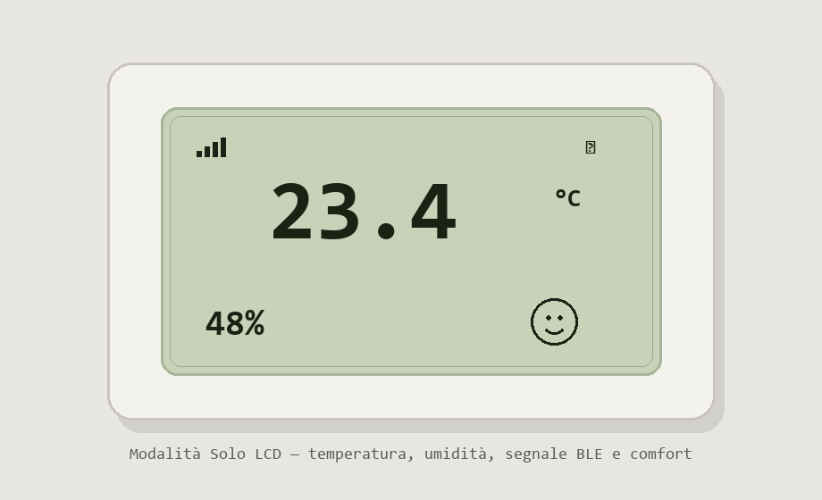

# Termometro Xiaomi (LYWSD03MMC / NUN4126GL)

App Windows per leggere temperatura e umidità da un termometro Xiaomi Mijia via Bluetooth Low Energy, con GUI stile LCD.

<p align="center">
  
</p>

<p align="center">
  <em>Display compatto con temperatura, umidità, barre segnale BLE e faccia comfort</em>
</p>

## Requisiti

- Windows 10/11
- Bluetooth attivo
- Python 3.11+ (solo per eseguire dai sorgenti)

## Avvio dai sorgenti

```powershell
python -m pip install -r requirements.txt
python gui_termometro.py
```

CLI:

```powershell
python leggi_termometro.py --scan
python leggi_termometro.py
```

## Funzionalità

- Lettura BLE a richiesta (connessione breve, poi disconnessione)
- Auto-refresh opzionale a intervallo lungo
- Indicatore segnale RSSI per capire il sensore più vicino
- Modalità **Solo LCD** (finestra compatta trascinabile)
- Manuale utente in `Manuale_utente.md` / `.pdf`

## Build portatile (.exe)

```powershell
.\build.bat
```

Output in `dist\TermometroXiaomi\` (serve tutta la cartella, inclusa `_internal`).

## Note

Chiudi l’app Xiaomi Home sul telefono durante l’uso: può tenere occupato il sensore.
